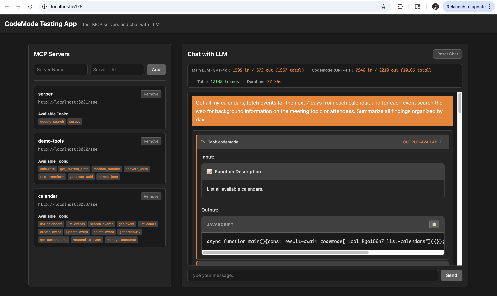
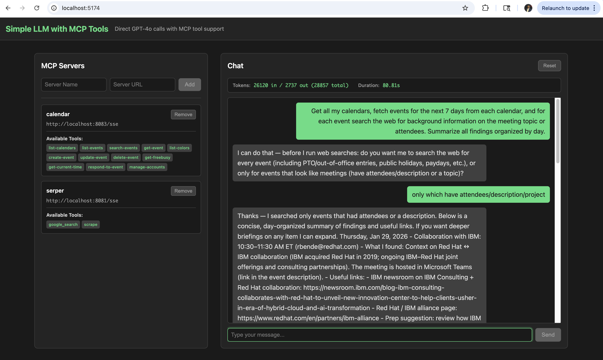

# Codemode Demo

LLM-powered code generation and execution in Cloudflare Workers V8 isolates.

## Performance Comparison

| Codemode                            | Traditional                              |
| ----------------------------------- | ---------------------------------------- |
|  |  |

Codemode executes multiple tools in parallel with a single code generation, while traditional tool calling requires sequential LLM round-trips.

## Quick Start

```bash
# From repo root
npm install
npm run build

# Navigate to this example
cd examples/codemode

# Create .env file
echo "OPENAI_API_KEY=sk-your-key-here" > .env

# Start dev server
npm start
```

Open http://localhost:5173 (or 5174/5175 if ports are in use).

## MCP Server Setup

### Google Calendar

**Setup:**

1. Go to [Google Cloud Console](https://console.cloud.google.com/) → Enable **Google Calendar API**
2. Create OAuth credentials: "APIs & Services" → "Credentials" → "OAuth client ID" → "Desktop app"
3. Download as `credentials.json`
4. Run auth: `npx @anthropic/mcp-server-google-calendar auth` (saves `token.json`)

**Start server:**

```bash
npx @anthropic/mcp-server-google-calendar --transport sse --port 3001
```

**Connect:** Name `google-calendar`, URL `http://localhost:3001/sse`

> Tokens expire after 7 days in "Testing" mode. Re-run auth command to refresh.

### Serper (Web Search)

Get API key from [serper.dev](https://serper.dev)

```bash
SERPER_API_KEY=your-key npx @anthropic/mcp-server-serper --transport sse --port 3002
```

**Connect:** Name `serper`, URL `http://localhost:3002/sse`

### GitHub

Create token at [GitHub Settings → Personal Access Tokens](https://github.com/settings/tokens) with `repo` scope.

```bash
GITHUB_PERSONAL_ACCESS_TOKEN=your-token npx @modelcontextprotocol/server-github --transport sse --port 3003
```

**Connect:** Name `github`, URL `http://localhost:3003/sse`

### Security

Add to `.gitignore`:

```
credentials.json
token.json
.env
```

## Project Structure

```
examples/codemode/
├── src/
│   ├── server.ts    # Durable Object agent
│   ├── client.tsx   # React frontend
│   └── tools.ts     # Local tool definitions
├── wrangler.jsonc   # Worker config
├── vite.config.ts   # Vite + Cloudflare plugin
└── .env             # OPENAI_API_KEY
```

## Configuration

### Environment Variables

| Variable         | Required | Description                   |
| ---------------- | -------- | ----------------------------- |
| `OPENAI_API_KEY` | Yes      | OpenAI API key for GPT models |

### Model Configuration

| Component    | Model                | Purpose                    |
| ------------ | -------------------- | -------------------------- |
| Main LLM     | `gpt-5-mini`         | Task orchestration         |
| Codemode LLM | `gpt-5.1-codex-mini` | JavaScript code generation |

Models are configured in:

- Main LLM: `src/server.ts`
- Codemode LLM: `packages/codemode/src/ai.ts`

## Known Issues & Fixes

See [FINDINGS.md](./FINDINGS.md) for detailed issue documentation.

### Quick Fixes Required

**1. Named Entrypoint Export**

If you see `Worker's binding "globalOutbound" refers to service with a named entrypoint...`:

In `src/server.ts`, change:

```typescript
// From
export const globalOutbound = { fetch: async (input, init) => { ... } };

// To
export class globalOutbound extends WorkerEntrypoint {
  async fetch(input, init) { ... }
}
```

**2. Add `__dirname` define**

In `vite.config.ts`:

```typescript
define: {
  __filename: "'index.ts'",
  __dirname: "'/'"  // Add this
}
```

## Resources

- [Cloudflare Code-Mode Blog](https://blog.cloudflare.com/code-mode/)
- [Agents SDK](https://github.com/cloudflare/agents)
- [FINDINGS.md](./FINDINGS.md) - Detailed research and fixes
